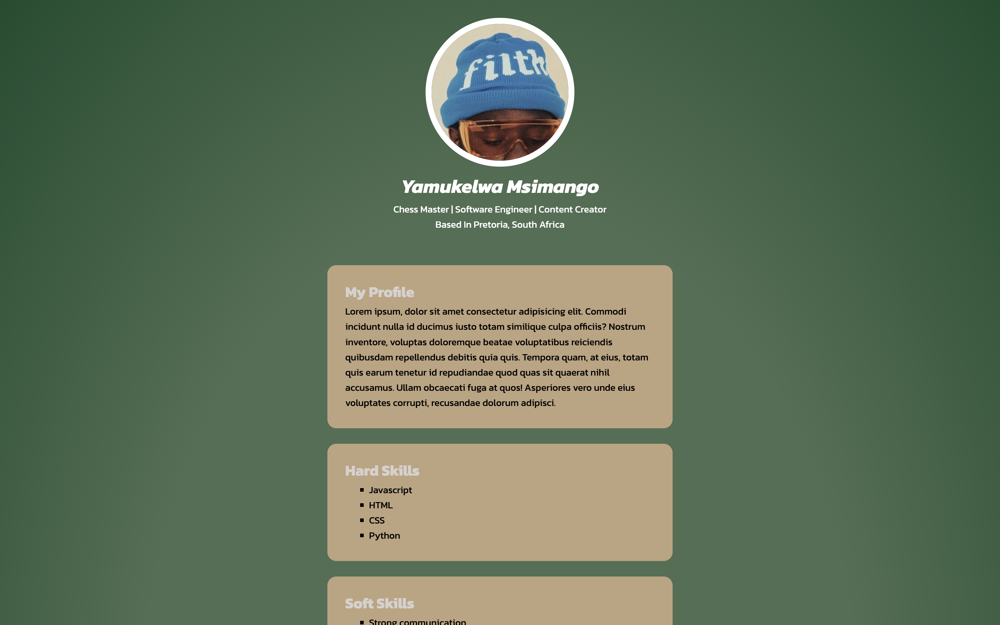

#### CV
###### Date Started: 02/22/2024
###### Last Updated: 06/04/2024
###### Deployment: Netlify

---
###### Tech Stack: HTML5 & CSS

---
##### Welcome to CV! If you're here, you're checking out how to make your simple CV and you can rest assured that you come to the right place. Feel free to explore, and remember, the code is yours to adapt and use however you like. Enjoy!
---

---

###### Features:
##### - Responsive design that adapts to different screen sizes.
##### - Semantic HTML5 elements for better structure and readability.
##### - External CSS file for styling.
##### - Detailed sections about profile, skills, professional experience, education, hobbies, and contact information.

###### Process:
##### - Started with a basic HTML5 template.
##### - Added semantic elements like `header`, `main`, `section`, and `footer`.
##### - Filled out each section with relevant information and structured them properly.
##### - Styled the webpage using an external CSS file.

###### Learnings:
##### - Gained a deeper understanding of HTML5 and CSS.
##### - Learned how to structure a webpage semantically.
##### - Improved skills in responsive web design.
##### - Gained experience in presenting personal information in a professional manner.
